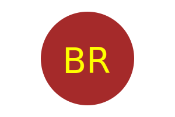

  
  # Object-oriented Programming: SVG Logo Maker

  

## Description

This application is for making SVG Logo by using Object-oriented Programming. As a freelance web developer, we want to generate a simple logo for our projects without having to pay a graphic designer. In fact, we can use the command line to make SVG logo for our project.

Here is a walkthrough video of this application "https://www.loom.com/share/01c8870ae43f4ef29b3c9ed5dd933050"

## Table of Contents (Step by Step Guide)

- Ask user to enter up to three characters for the text on the logo
- Ask user to enter a color keyword (OR a hexadecimal number) for the text color
- Ask user to choose from: circle, triangle, and square for the shape of the logo
- Ask what color they prefer their shape of logo to be
- If all input was submitted correctly then "Generated logo.svg" will be printed in the command line
- A new customized SVG file will be created based on the input which can be seen in the browser

## SnapShot

The following shows a snapshot of my SVG file:

## Contribution
  Contributions are not accepted at the moment